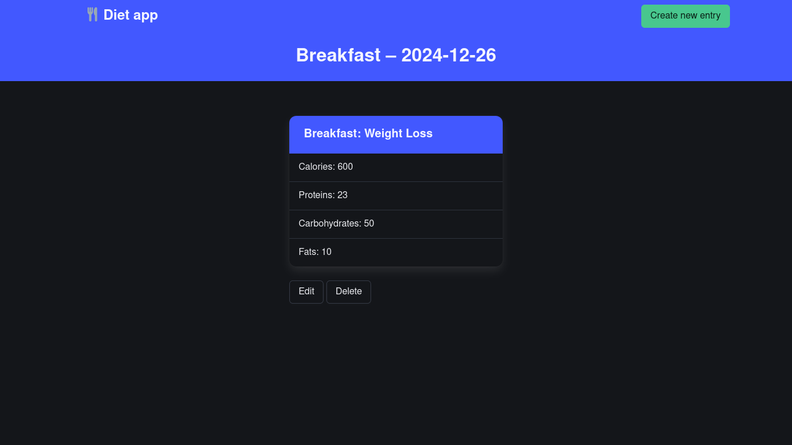

# Diet app

## Project Details

Ruby on Rails diet app.



## System Requirements

* Ruby 3.3.6
* Rails 8.0.1

## Running
```bash
git clone https://github.com/cryptrunner49/diet-app
cd diet-app
rails db:migrate
rails server
```

## Running with docker or podman
### docker
```bash
sudo docker build -t diet-app .
sudo docker run -d -p 127.0.0.1:3000:3000 diet-app
```
### podman
```bash
podman build -t diet-app .
podman run -d -p 127.0.0.1:3000:3000 diet-app
```

## Running with docker compose or podman-compose
### docker compose
```bash
sudo docker compose up
```
### podman-compose
```bash
podman-compose up
```